# Integrating Resilient IRP with IBM QRadar SIEM using Rest API's

In this Code Pattern, we will be integrating `IBM Resilient Incident Response Platform (IRP)` with `IBM QRadar Security information and event management (SIEM)` using Rest API's. Today’s security information and event management systems (SIEM) operate with a more extensive knowledge base than their predecessors, and they are more useful in detecting and logging data than ever before—but they are never more powerful than when they are paired with a incident response (IR) platform.By integrating the Resilient Incident Response Platform (IRP) with IBM QRadar, security teams are empowered to simplify and streamline the process of escalating and managing incidents.
In this Code Pattern, we will showcase a methodology in which we will be creating `speed` and `location` related offences on IBM QRadar which will later be sent to `abc` and `xyz` organization on IBM Resilient Incident Response Platform respectively, using our `QRadar-Resilient Integration` Application.


When the reader has completed this Code Pattern, they will understand how to:

* Access the offences from IBM QRadar using Rest API.
* Create incidents on IBM Resilient using Rest API.
* Send offences from QRadar to their respective organizations on Resilient.

<!--add an image in this path-->
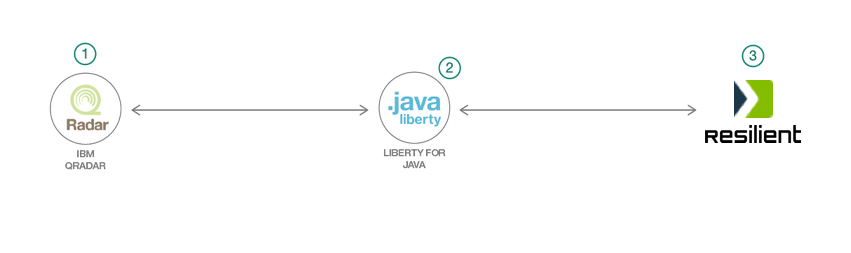

<!--Optionally, add flow steps based on the architecture diagram-->
## Flow

1. Get all the offences from the IBM QRadar.
2. Convert these offences into Resilient incident format.
3. Send these incidents to their respective organization.

<!--Optionally, update this section when the video is created-->
# Watch the Video

## Pre-requisites

* [IBM QRadar Community Edition](https://developer.ibm.com/qradar/ce/): IBM is bringing free QRadar to a wider audience with Community Edition. Community Edition is a fully-featured version of QRadar that is low memory, low EPS, and includes perpetual license.
* [IBM Resilient](https://www.resilientsystems.com/): IBM Resilient Incident Response Platform (IRP) is the leading platform for orchestrating and automating incident response processes.
* [Maven](http://maven.apache.org/download.cgi) - needed to build the client. Maven is a build automation tool used primarily for 
projects. Maven addresses two aspects of building software: first, it describes how software is built, and second, it describes its dependencies.

# Steps

Please follow the below to setup and run this code pattern.

1. [Clone the repo](#1-clone-the-repo)
2. [Create organizations on Resilient](#2-create-organizations-on-resilient)
3. [Create rules to detect offences on QRadar](#3-create-rules-to-detect-offences-on-QRadar)
4. [Build the QRadar-Resilient Integration Application using Maven](#4-build-the-qradar-resilient-integration-application-using-maven)
5. [Deploy and Run the Application](#5-deploy-and-run-the-application)

### 1. Clone the repo

Clone the `Integrating Resilient IRP with IBM QRadar SIEM using Rest API's` repo locally. In a terminal, run:

```
$ git clone https://github.com/IBM/managing-security-incidents
```

We’ll be using the folder [`Java/`](Java/)

### 2. Create organizations on Resilient

* Do an ssh to your resilient root.
* Create two organizations `abc` and `xyz` on resilient using the following commands:

```
sudo resutil newuser -createorg -email "username@company.com" -first "Rxxxx" -last "Rxxxx" -org "abc"
```

```
sudo resutil newuser -createorg -email "username@company.com" -first "Rxxxx" -last "Rxxxx" -org "xyz"
```
In this pattern, we will be sending all the speed related offences to `abc` orginzation and location reated offences to `xyz` organization.

### 3. Create rules to detect offences on QRadar

**Setup QRadar for detecting speed and location related offences**

* Open the `QRadar Console` from a browser. From the menu, select `Admin` to go to the `Admin` view.


* Scroll down to the `Data sources` section and select `Log Sources`.
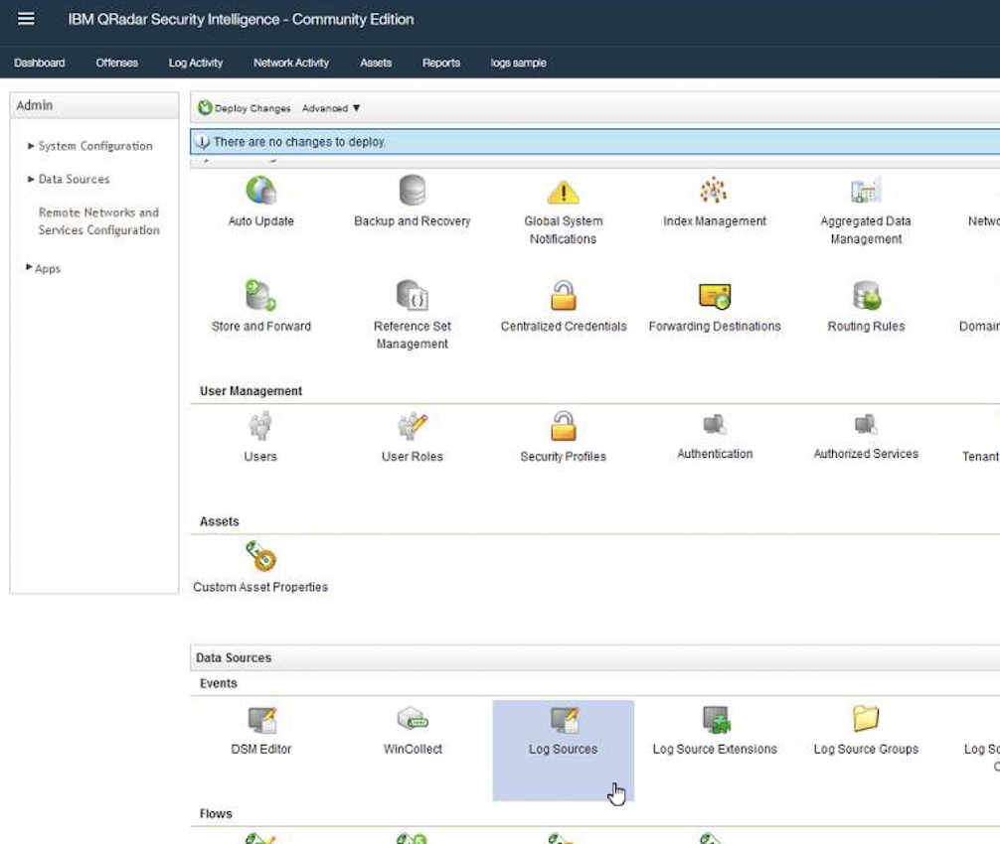

* Click on `Add` to add a new log source.

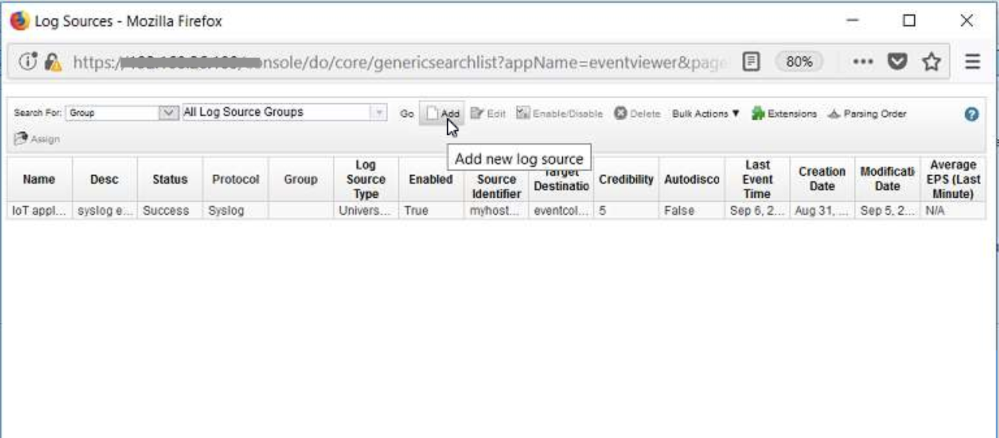

* Configure the log source with the values shown. Click on `Save`.

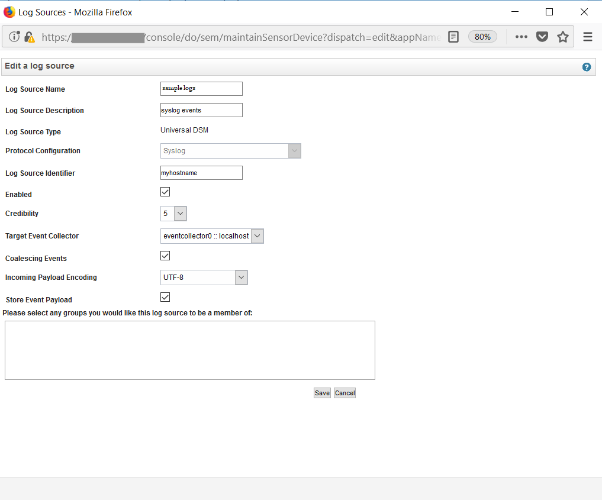

* In the `Admin` view, click on `Deploy changes` to add the newly configured log source.

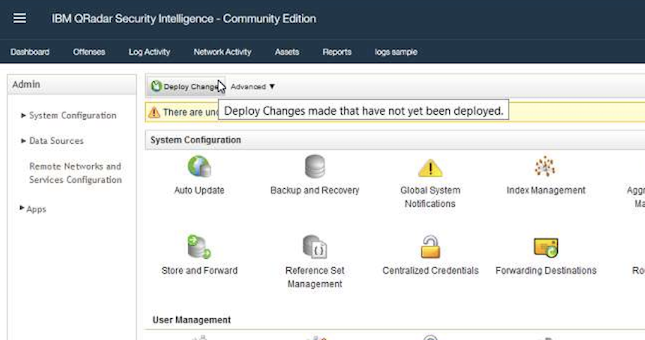

* Go to `Log Activity` view.

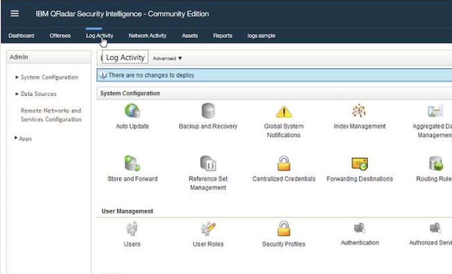

* Go to the `Rules` view by clicking on `Rules` menu.

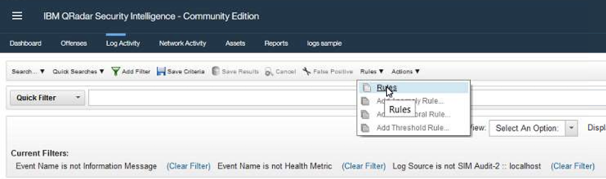

* Select `Actions` and then `New Common Rule`.

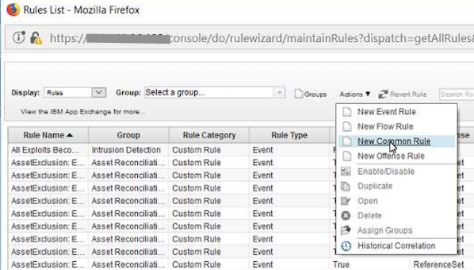

* The rule wizard opens. Click `Next`.

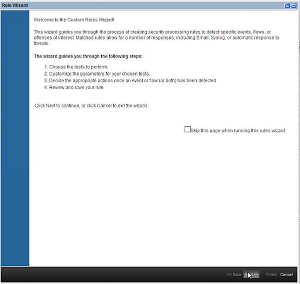

* Select `Events or flows`. Click `Next`.

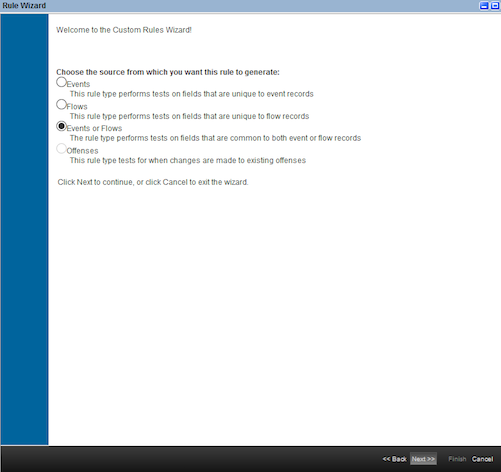

* On the `Rule Test Stack Editor`, enter a filter keyword `payload`.

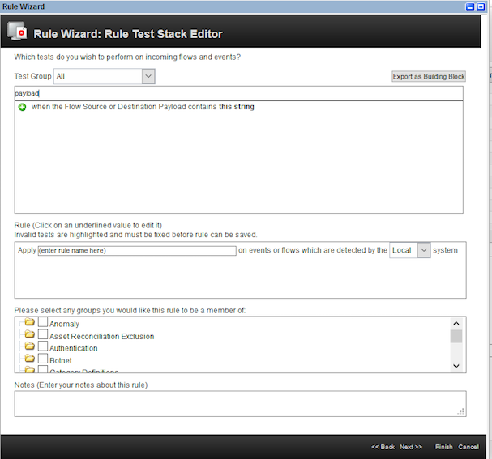

* Select the rule `When the Flow Source or Destination Payload contains this string`. Enter the rule name as `speed violation` while creating rule to detect speed offence and `wrong location` while creating rule to detect location offence. Click on the hyperlink `this string` as shown.


* Enter the string as `SPEEDING` while creating rule to detect speed offence and  `LOCATION` while creating rule to detect location offence. This is the string that we will send in the payload. Click `Submit`.

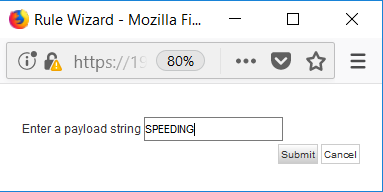     

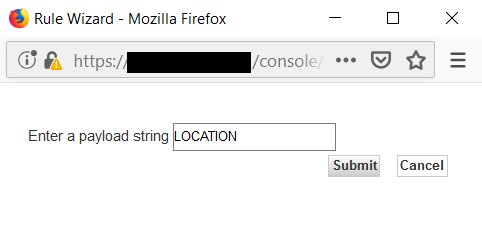

* Select the group as `Policy`.


* Click `Next`.

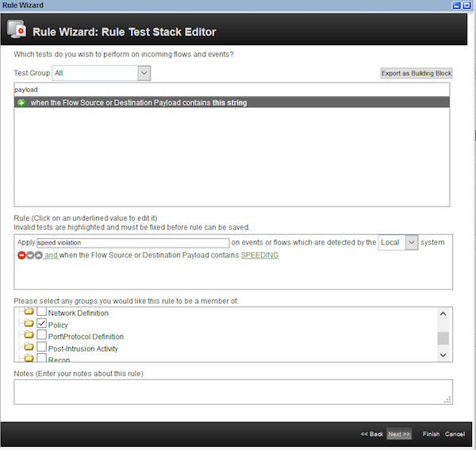

* On the `Rule Response` page,
  
  **while creating rule to detect speed offence**, enter the values as shown. Click `Next`.

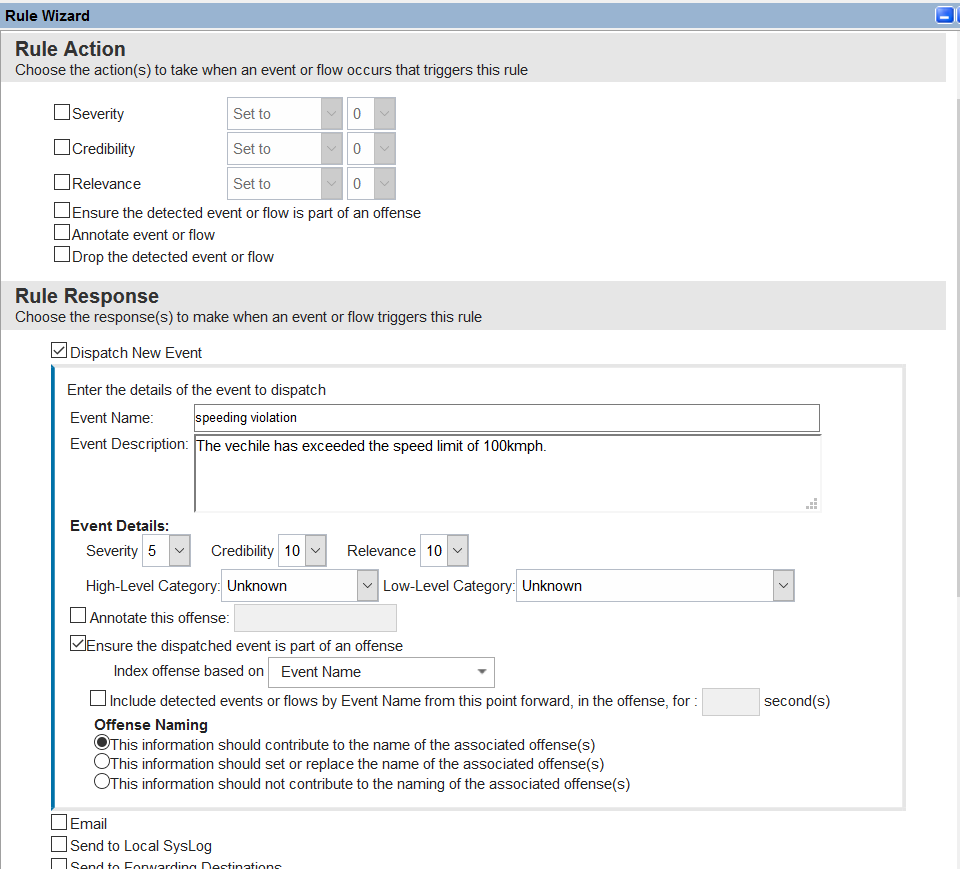

   **while creating rule to detect location offence**, enter the values as shown. Click `Next`.


* Click `Finish` on the `Rule summary` page.


* The newly created rule has been added to the list of rules.

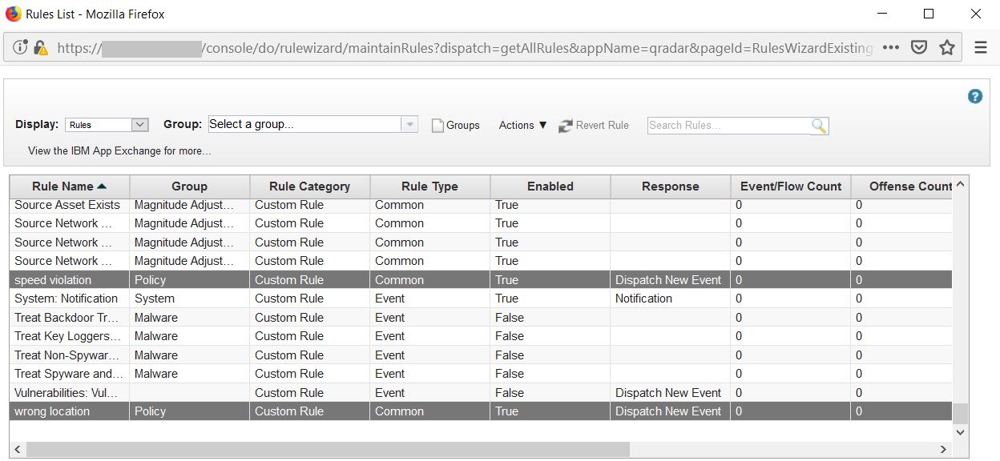

You have successfully created rules to detect `speed` and `location` related offences. Now you are ready to send events and offences to QRadar.

>>NOTE: Please refer to [Monitor device events using QRadar](https://developer.ibm.com/patterns/detect-security-offenses-for-iot-devices-using-qradar/) for more information on rules and offences.

### 4. Build the Applications using Maven

**QRadar-Resilient Integration Application**

* The QRadar-Resilient Integration Application sources are present in the folder `Java/integrate` of the repo.
* Check your environment before executing the next step. Make sure, you are able to run `mvn` commands properly.
   > If `mvn` commands fails, please refer to [Pre-requisites](#pre-requisites) to install maven.


To work with the QRadar-Resilient Integration Application, perform the following steps.

* Open a command terminal and navigate to the `java/integrate` directory in the repo. Run the command `mvn install`.

   ```
   cd ../java/integrate
   mvn install
   ```

* A jar file `QRadar-Resilient-0.0.1-SNAPSHOT-jar-with-dependencies.jar` is built and can be found under the `target` folder. This jar can be renamed to `QRadar-Resilient.jar` to keep the name short. 

   ```
   cd target
   cp QRadar-Resilient-0.0.1-SNAPSHOT-jar-with-dependencies.jar QRadar-Resilient.jar
   ```
  
**Offences Application**

* The Offences Application sources are present in the folder `Java/offences` of the repo.
* Check your environment before executing the next step. Make sure, you are able to run `mvn` commands properly.
   > If `mvn` commands fails, please refer to [Pre-requisites](#pre-requisites) to install maven.


To work with the QRadar-Resilient Integration Application, perform the following steps.

* Open a command terminal and navigate to the `java/offences` directory in the repo. Run the command `mvn install`.

   ```
   cd ../java/offences
   mvn install
   ```

* A jar file ` offences-0.0.1-SNAPSHOT-jar-with-dependencies.jar` is built and can be found under the `target` folder. This jar can be renamed to `offences.jar` to keep the name short. 

   ```
   cd target
   cp  offences-0.0.1-SNAPSHOT-jar-with-dependencies.jar offences.jar
   ```
   
### 5. Deploy and Run the Application

 * First let us create a speed related offence on QRadar,by execute the following command from the target directory(directory where the offences.jar file is located).
 
   ```
   java -cp offences.jar org.app.offences.SendOffences
   ```
   Fill in your QRadar Hostname/IP Address and enter 1 to sent speed related offence,
  
   Output: 

      ``` 
      >>>Enter the QRadar Hostname/IP Address
      192.168.xxx.xxx
      >>>Enter 1 to send SPEED related offence.
      >>>Enter 2 to send LOCATION related offence.
      1
      Offence successfully sent
      ```
   Go to `offences` tab on QRadar to check if the offence is created.  

 * To deploy and run the QRadar-Resilient Integration application, execute the following command from the target directory(directory where the QRadar-Resilient.jar file is located).

   ```
   java -cp QRadar-Resilient.jar org.app.integrate.Task
   ```
   Output on terminal: 
   
   ```
    >>>Enter your QRadar username:
    admin
    >>>Enter your QRadar password:
    xxxxxxxxx
    >>>Enter your QRadar hostname/IP Address:
    192.168.xxx.xxx
    >>>Enter your Resilient email:
    username@company.com
    >>>Enter your Resilient password:
    xxxxxxxxxx
    >>>Enter your Resilient hostname/IP Address:
    192.168.xxx.xxx

    PREPARING TO SEND THE OFFENCE : {"security_category_count":1,"source_count":1,"event_count":1,"description":"The vechile has exceeded the speed limit of 100kmph\n","offense_type":2,"local_destination_count":1,"follow_up":false,"domain_id":0,"inactive":true,"protected":false,"closing_user":null,"offense_source":"speeding violation","source_address_ids":[2],"credibility":3,"magnitude":3,"source_network":"Net-xx-xxx-xxx.Net_192_168_0_0","id":5,"categories":["Unknown"],"closing_reason_id":null,"device_count":1,"assigned_to":null,"severity":5,"local_destination_address_ids":[2],"close_time":null,"policy_category_count":0,"relevance":5,"destination_networks":["Net-xx-xxx-xxx.Net_192_168_0_0"],"remote_destination_count":0,"start_time":1542863188789,"flow_count":0,"last_updated_time":1542863188789,"category_count":1,"username_count":0,"status":"OPEN"}
    Response Code : 200
    Incident Response Code : 200
    SENT THE OFFENCE WITH ID : 1 TO RESILIENT
    INCIDENT CREATED IN  ORG : abc ( ORG ID : 206) WITH ID : 2230
    Successfully sent offence id 1 to resilient
    Offence ID's that are sent to resilient : [1]
    Waiting for new offences
    Waiting for new offences
    Waiting for new offences
   ```
   
Now just to make sure our application runs dynamically let's send a location based offence. After the Location based offence is detected in QRadar,the output looks like:

   Output on terminal:
   ```
>>>Enter your QRadar username:
admin
>>>Enter your QRadar password:
xxxxxxxxxx
>>>Enter your QRadar hostname/IP Address:
192.168.xxx.xxx
>>>Enter your Resilient email:
username@company.com
>>>Enter your Resilient password:
xxxxxxxxx
>>>Enter your Resilient hostname/IP Address:
192.168.xxx.xxx

PREPARING TO SEND THE OFFENCE : {"security_category_count":1,"source_count":1,"event_count":1,"description":"The vechile has exceeded the speed limit of 100kmph\n","offense_type":2,"local_destination_count":1,"follow_up":false,"domain_id":0,"inactive":true,"protected":false,"closing_user":null,"offense_source":"speeding violation","source_address_ids":[2],"credibility":3,"magnitude":3,"source_network":"Net-xx-xxx-xxx.Net_192_168_0_0","id":5,"categories":["Unknown"],"closing_reason_id":null,"device_count":1,"assigned_to":null,"severity":5,"local_destination_address_ids":[2],"close_time":null,"policy_category_count":0,"relevance":5,"destination_networks":["Net-xx-xxx-xxx.Net_192_168_0_0"],"remote_destination_count":0,"start_time":1542863188789,"flow_count":0,"last_updated_time":1542863188789,"category_count":1,"username_count":0,"status":"OPEN"}
Response Code : 200
Incident Response Code : 200
SENT THE OFFENCE WITH ID : 1 TO RESILIENT
INCIDENT CREATED IN  ORG : abc ( ORG ID : 206) WITH ID : 2230
Successfully sent offence id 1 to resilient
Offence ID's that are sent to resilient : [1]
Waiting for new offences
Waiting for new offences
Waiting for new offences

PREPARING TO SEND THE OFFENCE : {"security_category_count":1,"source_count":1,"event_count":3,"description":"The device has been moved into a restricted area\n","offense_type":2,"local_destination_count":1,"follow_up":false,"domain_id":0,"inactive":true,"protected":false,"closing_user":null,"offense_source":"wrong location","source_address_ids":[1],"credibility":3,"magnitude":2,"source_network":"Net-xx-xxx-xxx.Net_192_168_0_0","id":2,"categories":["Unknown"],"closing_reason_id":null,"device_count":1,"assigned_to":null,"severity":5,"local_destination_address_ids":[1],"close_time":null,"policy_category_count":0,"relevance":5,"destination_networks":["Net-xx-xxx-xxx.Net_192_168_0_0"],"remote_destination_count":0,"start_time":1542348416722,"flow_count":0,"last_updated_time":1542602582339,"category_count":1,"username_count":0,"status":"OPEN"}
Response Code : 200
Incident Response Code : 200
SENT THE OFFENCE WITH ID : 2 TO RESILIENT
INCIDENT CREATED IN  ORG : xyz ( ORG ID : 207) WITH ID : 2231
Successfully sent offence id 2 to resilient
Offence ID's that are sent to resilient : [2,1]
Waiting for new offences
   ```
This Application works dynamically.It checks for new offences at regular intervals.If a new offence is detected, it will be sent to its respective Resilient organization.

Watch the [video](#watch-the-video) for the live demo.
  
Please check [`Java/integrate/src/main/java/org/app/integrate/Resilient.java`](Java/integrate/src/main/java/org/app/integrate/Resilient.java) and [`Java/integrate/src/main/java/org/app/integrate/QRadar.java`](Java/integrate/src/main/java/org/app/integrate/QRadar.java) to add a new offence source and its respective Resilient organization.
  

## Troubleshooting

If you encounter any certificate related exceptions, [See DEBUGGING.md.](DEBUGGING.md)

## License
[Apache 2.0](LICENSE)

